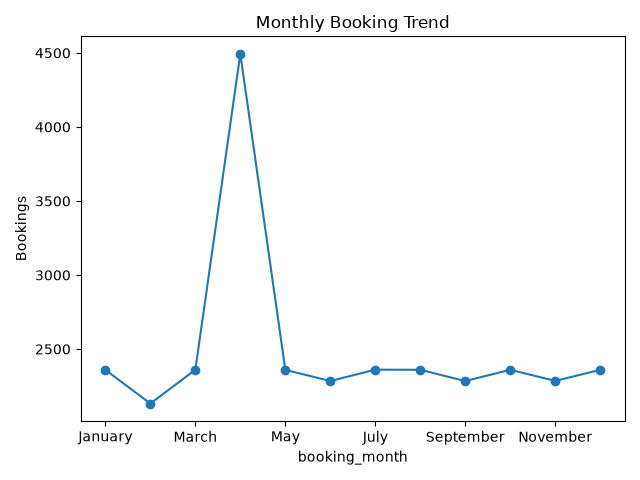
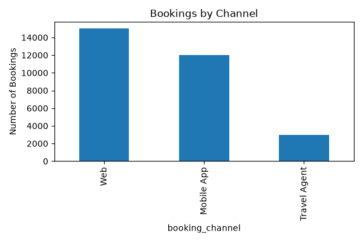
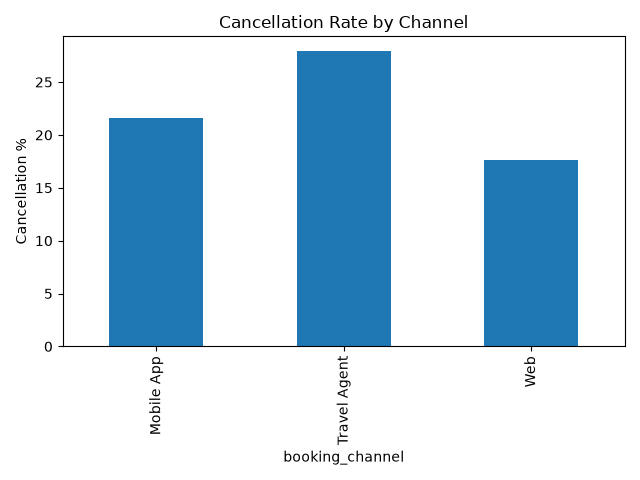
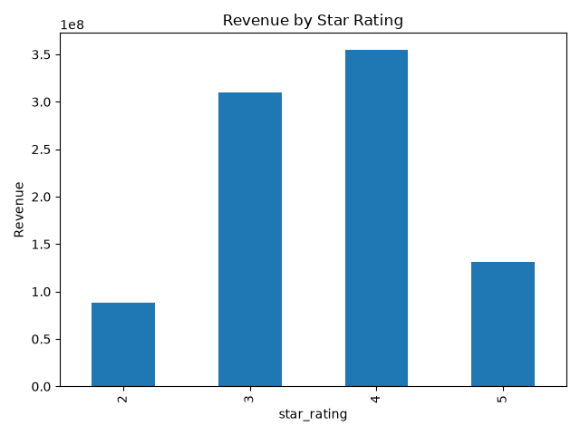
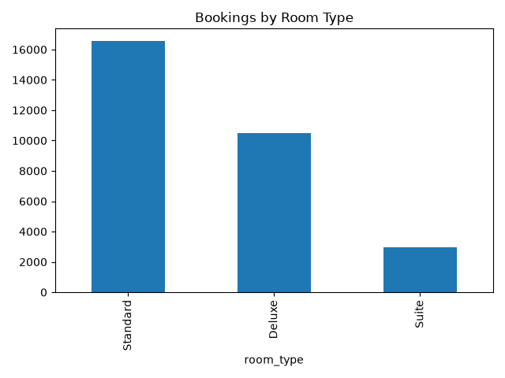

# Hotel Booking Analysis

## Project Overview

This repository delivers a polished exploratory data analysis of hotel bookings from an online travel dataset. The study reveals booking patterns, cancellation drivers, channel performance, and revenue opportunity areas to support better decision-making.

---

## Project Snapshot

- **Dataset:** `data/Trav_clan(Hotel_bookings_final).csv`
- **Records:** ~30,000
- **Focus areas:** channel performance, cancellation risk, room type demand, seasonality, revenue mix
- **Tools:** Python, Pandas, NumPy, Matplotlib, Seaborn, Jupyter Notebook

---

## Key Insights

- The **Web channel** delivers the highest booking volume and revenue share.
- **Travel Agent** bookings show the worst cancellation performance.
- **Standard room types** are the most frequently booked segment.
- **4-star hotels** drive the strongest revenue contribution.
- **April** emerges as the busiest month for booking demand.

---

## Professional Result Gallery

### Booking Trends

### Channel Performance & Cancellation Risk

### Revenue and Room Mix

---

## Analysis Approach

1. Load and validate the dataset
2. Clean and engineer features for consistency
3. Perform exploratory data analysis (EDA)
4. Compare booking and cancellation patterns across channels
5. Extract business insights and create practical recommendations

---

## Business Recommendations

- Strengthen the **Web sales channel** with targeted promotions and user experience improvements.
- Reassess **Travel Agent agreements** and cancellation policies to reduce revenue leakage.
- Promote **standard room upsell** opportunities and loyalty incentives.
- Optimize pricing for **4-star inventory** during high-demand periods.
- Prepare seasonal marketing and pricing actions around **April** and other peak months.

---

## Repository Structure

- `data/` — dataset source files
- `notebook/` — exploratory analysis notebook
- `output/` — visualization assets and generated charts
- `report/` — executive summaries or presentation-ready deliverables

---

## Getting Started

1. Create or activate a Python virtual environment.
2. Install dependencies from `requirements.txt`.
3. Open `notebook/Hotel_Booking_Analysis.ipynb`.
4. Run the notebook cells sequentially to reproduce the analysis.

---

## Notes

- Verify the dataset path before running the notebook.
- Update `requirements.txt` if library versions change.
- Use the exported charts in `output/` for executive summaries.

---

## Contact

If you have questions or want to extend the analysis, refer to the notebook or reach out to the project owner.
